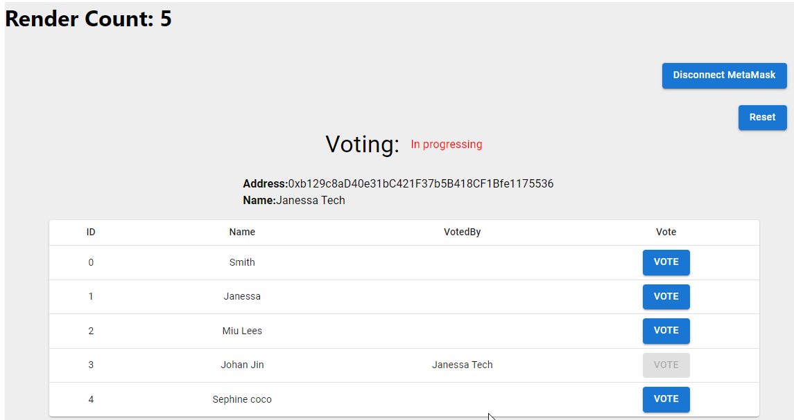

### How does project work



### Install dependences

```
npm install @mui/material @emotion/react @emotion/styled
npm install @fontsource/roboto
npm install @mui/icons-material
npm install react-router-dom
npm install hardhat
npm install --save @nomicfoundation/hardhat-toolbox


```

### Which features in react are used in this project?

- How to use route
- How to use useState, useEffect, useRef
- How to use useNavigate
- How to use ethers

### How to start

For local test:

1. Go into the solidity, install dependences by running `npm intall`
2. Start remixd(make sure you installed it on local, if not, run command `npm install -g @remix-project/remixd`) by running `remixd.cmd`(in windows) or `remixd`(in linux) under under the root directory
3. Start local harthat under the root directory by running `npx hardhat node`
4. Go to online remix, connect localhost first, deploy MyVoting.sol under contracts directory using harthat as provider
5. Install MetaMask, configure the network to connect to the local hardhat,and then switch MetaMask to being using this network
6. Import at least two accounts generated by hardhat by default into MetaMask
7. Update contractAddr in constants.js under src/Constant to the address of MyVoting.sol deployed in #4
8. Start react when you are sure everything above is ready by running `npm start`

For testnet( Sepolia):

1. Make sure you've had an account in Infura and created a new API key
2. Deploy https://github.com/JanessaTech/exercises/tree/master/solidity/contracts/voting/MyVoting.sol using remix or hardhat or whatever you like
3. Update the address of MyVoting.sol deployed on Sepolia to be the value of contractAddr in src/Constant/constants.js
4. Start react when you are sure everything above is ready by running `npm start`
