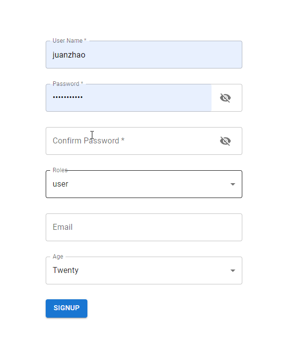
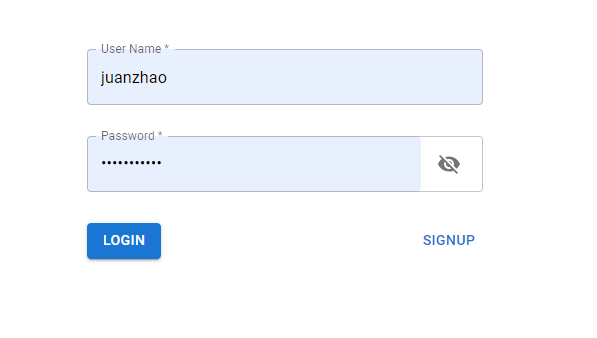
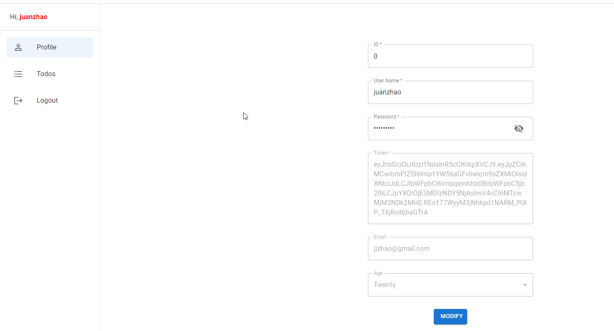
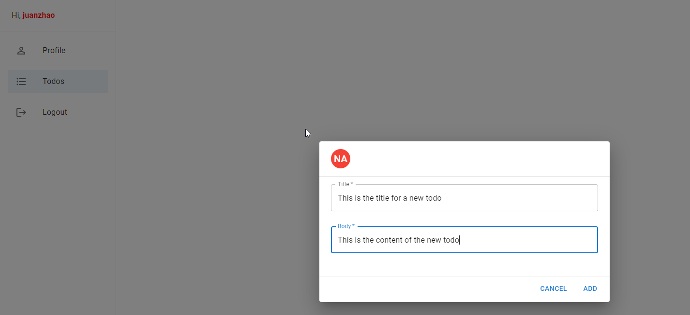
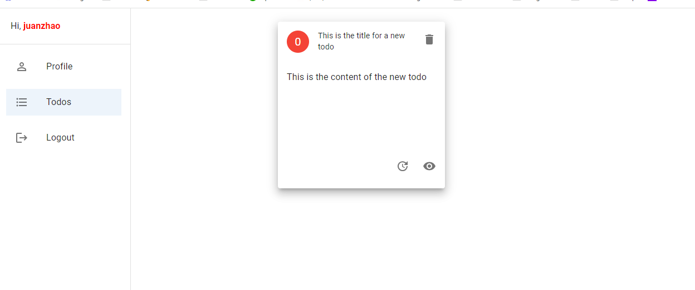

# How does the project work like?

- Signup
  
- Login
  
- Show profile
  
- Add a new todo
  
  

# Installed dependencies

```
npm install @mui/material @emotion/react @emotion/styled
npm install @fontsource/roboto
npm install @mui/icons-material
npm install react-router-dom
npm install react-draggable
npm install axios
npm install react-hook-form @hookform/resolvers yup
```

# Run codes

```
npm install (run it only for the first time)
npm start
```

# Which features are used in this project?

- How to route
- How to use localStorage
- How to use useNavigate
- How to use useOutlet
- How to use Context
- How to use axios
- How to use react-hook-form
- How to use yup
