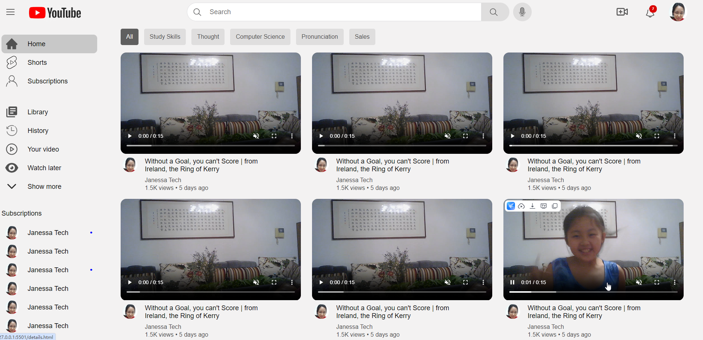
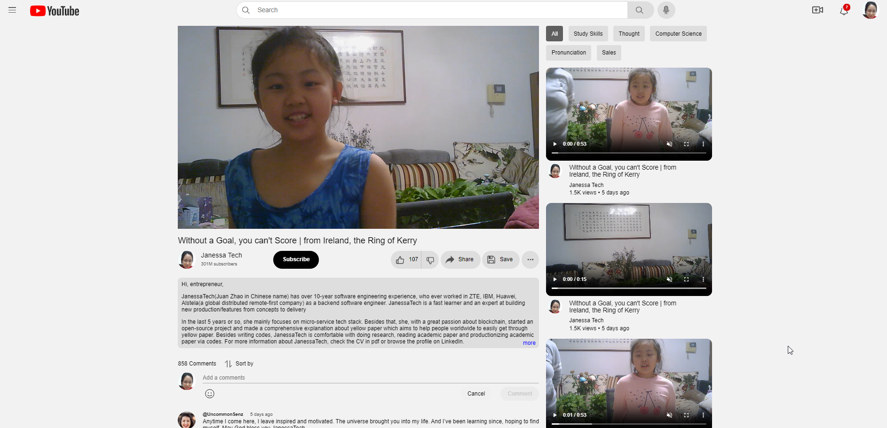

# About this project

This project is a dummy clone of youtube to showcase the solid understanding of HTML and CSS
The project doesn't use any library or tool, just pure CSS + HTML + Javascript only

# How to run

- Install live server
- Run live server
  Right-click on index.html and click on Open with Live Server(I am assume you project in VSCode)
  You will see like blow:
  The home page:
  The detail page:
