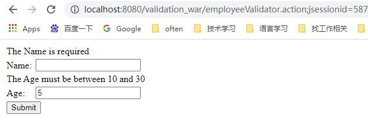

How to run:
1. Configure Intellij
   Similar as helloword example. Application context is: /validation_war
2. Run the new configuration
3. http://localhost:8080/validation_war/index.action will be launched automatically 
    3.1 Input wrong name and age, saying input nothing for Name, 5 for Age, the click [Submit] button, 
    You will see like below: 
    
    3.2 Input correct name and age, saying input Juan for Name, 22 for Age, the click [Submit] button, 
    The page will show "Employee Information is captured successfully. "